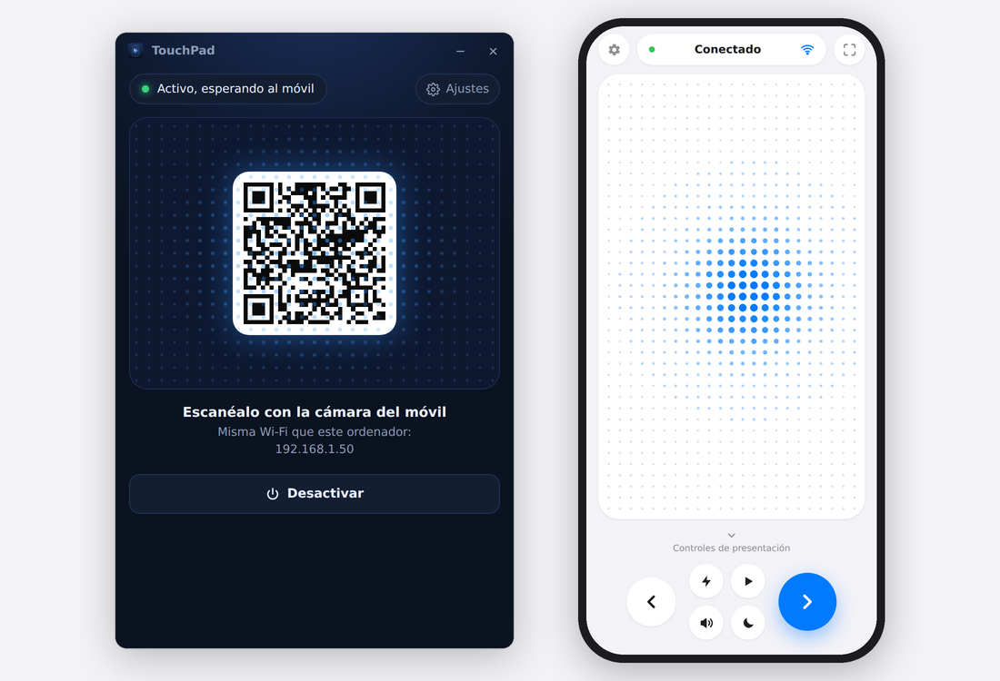
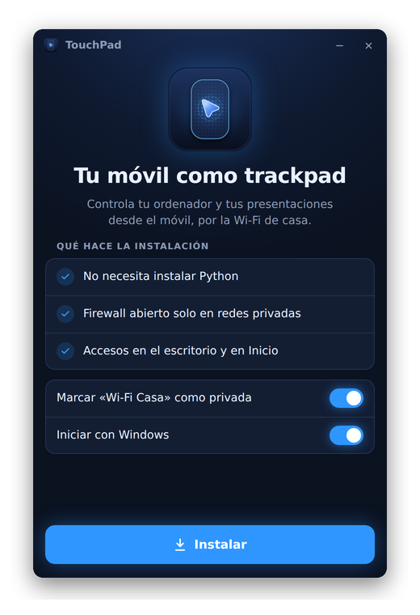
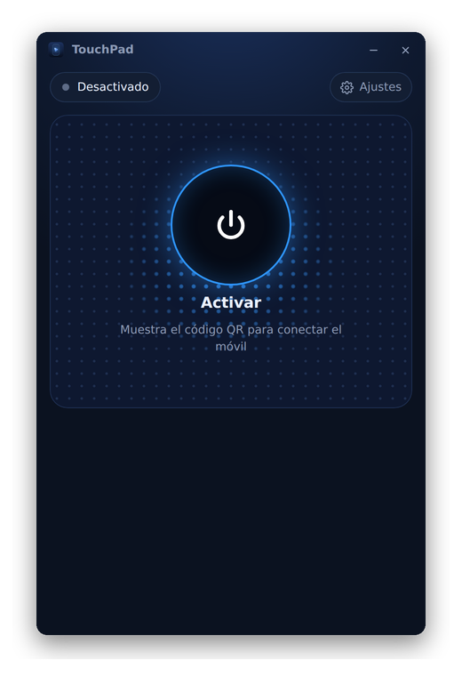
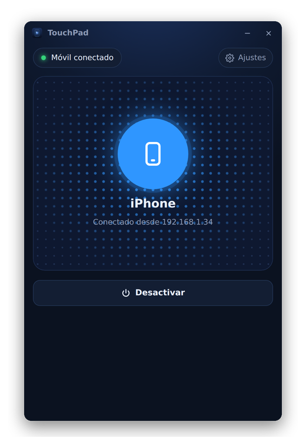
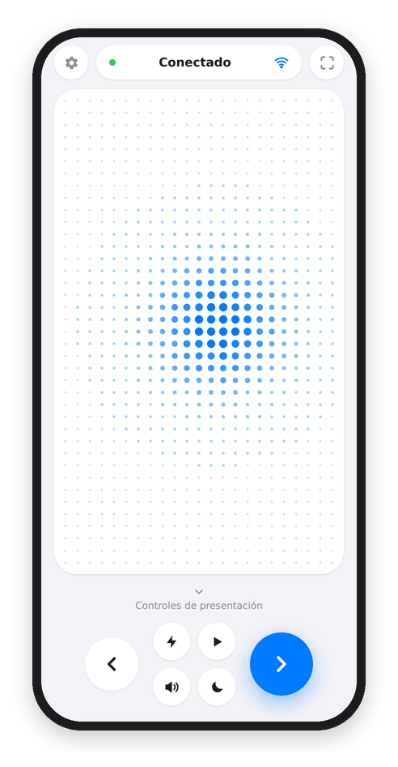
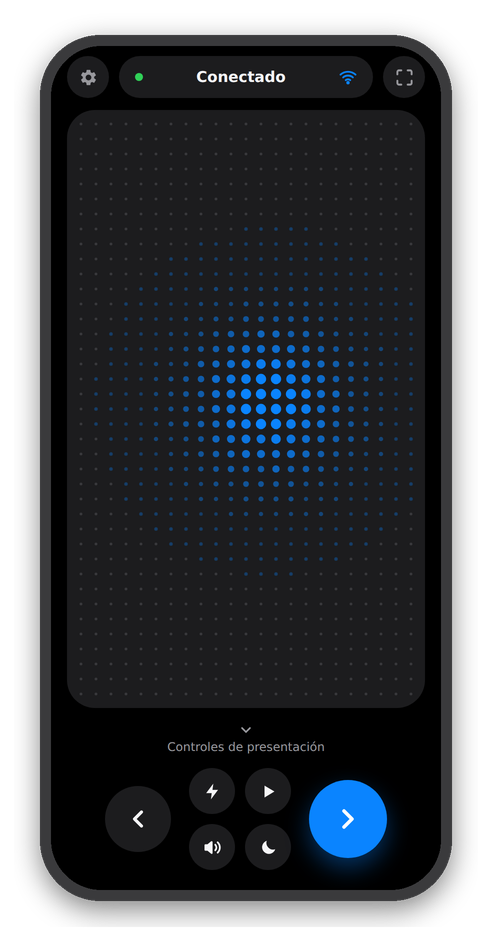
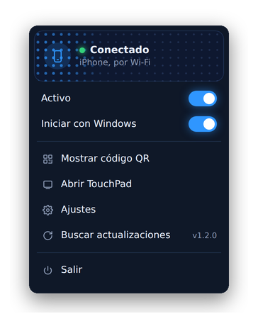
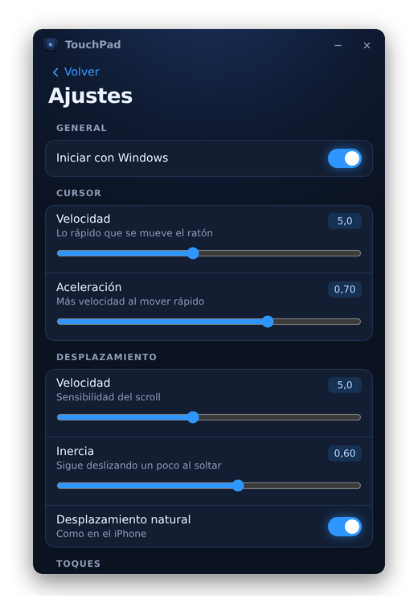

<p align="center"></p>

<h1 align="center">TouchPad</h1>

<p align="center">
  Usa tu móvil como <b>trackpad</b> y <b>mando de presentaciones</b> para Windows y Mac, por la Wi-Fi de casa.<br>
  Sin instalar nada en el móvil: funciona en Android y en iPhone desde el navegador.
</p>

<p align="center">
  <a href="https://github.com/hectoormv/touchpad/releases/latest/download/TouchPad.exe"><b>⬇ Windows</b></a>
  &nbsp;·&nbsp;
  <a href="https://github.com/hectoormv/touchpad/releases/latest/download/TouchPad-Mac.zip"><b>⬇ Mac (Apple Silicon)</b></a>
</p>

<p align="center">
  <picture>
    <source media="(prefers-color-scheme: dark)" srcset="docs/portada-oscuro.png">
    
  </picture>
</p>

## Cómo funciona

1. Descarga TouchPad desde [Releases](https://github.com/hectoormv/touchpad/releases/latest) (**TouchPad.exe** en Windows, **TouchPad-Mac.zip** en Mac), ábrelo y pulsa **Instalar**.
2. Pulsa **Activar**: aparece un código QR.
3. Escanéalo con la cámara del móvil (misma Wi-Fi) y ya puedes controlar el PC.
4. En el móvil, guárdalo con «Añadir a pantalla de inicio» para tenerlo como una app.

<p align="center">
  
  
  
</p>

## En el móvil

El trackpad es una matriz de puntos que se ilumina bajo el dedo. Debajo están los controles de presentación.

<p align="center">
  
  &nbsp;&nbsp;
  
</p>

| Gesto | Acción |
| --- | --- |
| Mover un dedo | Mover el ratón |
| Tocar | Clic |
| Tocar con dos dedos | Clic derecho |
| Deslizar dos dedos | Desplazar (scroll) |
| Mantener pulsado | Arrastrar |

Controles de presentación: diapositiva anterior y siguiente, iniciar y salir (F5 / Esc), puntero láser, pantalla negra, volumen y play/pausa.

## Menú de la bandeja y ajustes

TouchPad se queda en segundo plano junto al reloj. Con **clic derecho** en su icono se abre un menú para activarlo, ver el QR, entrar en los ajustes o buscar actualizaciones. En los **Ajustes** del ordenador se configuran la velocidad del cursor, la aceleración, el scroll (velocidad, inercia y dirección natural) y los gestos; el móvil los aplica al momento.

<p align="center">
  
  
</p>

La app del móvil tiene modo **Automático, Claro y Oscuro**: en automático sigue el tema del móvil.

## En Mac

- Descomprime **TouchPad-Mac.zip** y abre **TouchPad.app**. Como no está firmada por Apple, la primera vez macOS la bloqueará: ve a **Ajustes del Sistema → Privacidad y seguridad** y pulsa **Abrir igualmente**.
- Al pulsar **Instalar** se copia a la carpeta Aplicaciones.
- Al activarlo por primera vez, macOS pedirá permiso de **Accesibilidad**: es necesario para que el móvil pueda mover el ratón.
- Funciona en Macs con chip de Apple (M1 o posterior).
- En Mac, «Iniciar» la presentación usa **Cmd+Shift+Intro** (PowerPoint y Google Slides).

## Seguridad

- El enlace del QR lleva un **token secreto**: sin él, el PC rechaza la conexión.
- En Windows, el firewall solo se abre en **redes privadas** (puertos 8765 y 8766).
- Todo funciona dentro de tu red local; nada pasa por internet.
- El tráfico no va cifrado, así que úsalo en redes de confianza como la de casa.

## Cómo está hecho

| Parte | Tecnología |
| --- | --- |
| Programa del ordenador | Python + [pywebview](https://pywebview.flowrl.com/) (ventana), [pystray](https://github.com/moses-palmer/pystray) (bandeja en Windows) |
| Conexión con el móvil | Servidor HTTP + WebSocket ([websockets](https://github.com/python-websockets/websockets)) |
| Control del ratón y teclado | `SendInput` en Windows (`ctypes`) y Quartz `CGEvent` en Mac ([PyObjC](https://pyobjc.readthedocs.io/)) |
| App del móvil | HTML, CSS y JavaScript (Canvas para la matriz de puntos) |
| Instaladores | [PyInstaller](https://pyinstaller.org/), compilados automáticamente con GitHub Actions en Windows y macOS |

Código: `touchpad/app.py` (programa e instalación), `touchpad/server.py` (servidor y control del ratón), `touchpad/ui.html` (interfaz del PC) y `touchpad/phone.html` (interfaz del móvil).

## Compilar

GitHub Actions compila el `.exe` y el `.app` en cada cambio. Para publicar una versión nueva:

```
git tag v1.1.0
git push origin v1.1.0
```

## Créditos

Inspirado en [Mousely](https://mouse.ly). TouchPad es un proyecto independiente escrito desde cero.

Librerías de terceros: pywebview, websockets y qrcode (BSD), Pillow (MIT-CMU), pystray (LGPL v3), PyObjC (MIT) y PyInstaller. Cada una mantiene su propia licencia.

## Licencia

[MIT](LICENSE) © 2026 Héctor Valles
